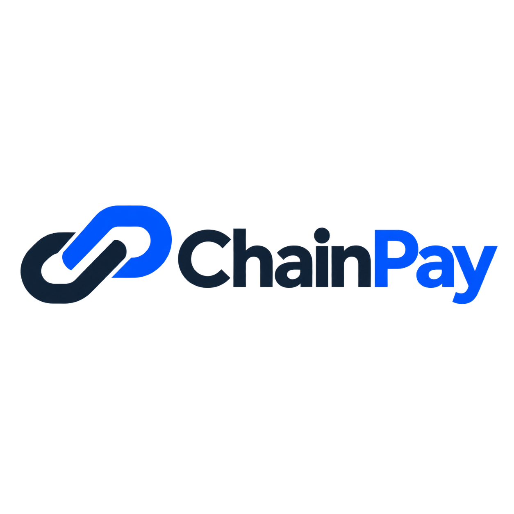
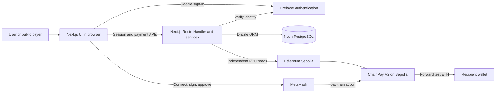
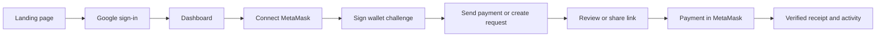
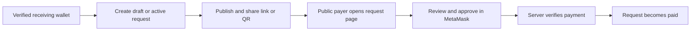
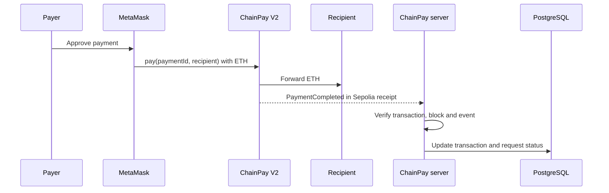

<p align="center">
  
</p>

<h1 align="center">ChainPay</h1>
<p align="center"><strong>Pay with blockchain, without the complexity.</strong></p>
<p align="center">A non-custodial payment experience for sending, requesting, and tracking Sepolia ETH.</p>

<p align="center">
  
  
  
</p>

> **Blockchain is the settlement and verification layer. ChainPay is the payment experience around it.** This repository implements the application and contracts; operating a connected instance requires Firebase, Neon, a Sepolia RPC endpoint, and deployed contract addresses. It is testnet software and has not been independently audited.

## Overview

MetaMask can transfer ETH, but a wallet alone does not organize who a payment is for, provide a shareable request, or keep a readable business record. ChainPay adds Google-backed accounts, verified wallet ownership, guided review, payment requests, contacts, activity, and receipts around an on-chain transfer. The sender still approves each transaction in MetaMask; ChainPay never holds the sender's keys or payment funds.

The product is aimed at individuals, freelancers, small merchants, and Web3 newcomers who need a clearer path from a payment request to a verifiable receipt. The UI supports English and Thai.

### Implemented features

| Area      | Capability                                                                                                                                           |
| --------- | ---------------------------------------------------------------------------------------------------------------------------------------------------- |
| Account   | Google sign-in, server session, profile settings, personal/merchant profile preference, saved dark/light appearance                                  |
| Wallet    | MetaMask connection, Sepolia network checks, signed ownership challenge, multiple linked wallets, primary-wallet selection, soft removal             |
| Pay       | Recipient/contact selection, amount validation, fee and balance estimate, review, MetaMask contract call, pending-state recovery                     |
| Request   | Draft and published requests, expiration/cancellation, public link and QR code; a payer can use an active link without a ChainPay account            |
| Records   | Server-backed transaction activity, status and direction filters, human-readable receipts, explorer links, private notes for the originating account |
| Interface | Responsive pages, English/Thai language toggle, dark/light product theme, loading/error states, reduced-motion support                               |

The browser's broadcast result is **not** a settlement decision. A server-side check compares the Sepolia transaction and receipt with an immutable payment intent before the database record becomes confirmed.

### Appearance

Dark is the default. Signed-in users can choose Dark or Light at `/settings/theme`; the preference is stored on their account and applies immediately across the authenticated product. A refresh or another device loads the saved value from PostgreSQL during server rendering. The marketing homepage, login, public payment links, and public receipts stay dark regardless of this setting. The light palette keeps ChainPay blue, layered glass surfaces, readable status colors, and the mobile bottom navigation.

## System architecture



The application is a single Next.js App Router project. Server Components render protected data; Client Components handle Google sign-in, forms, wallet interaction, QR codes, and receipt polling. `src/app/api/[...path]/route.ts` is the HTTP boundary and delegates business rules to `src/features/*/server.ts`. There is no separate Express or Render backend.

| Layer                       | Responsibility                                                                                       |
| --------------------------- | ---------------------------------------------------------------------------------------------------- |
| Browser and Next.js UI      | Collect payment details, display review/status, request wallet signatures                            |
| Firebase Authentication     | Google application identity and revocation-aware session verification                                |
| Next.js server              | Authorization, validation, payment intents, database access, independent blockchain verification     |
| Neon PostgreSQL and Drizzle | Accounts, verified wallets, request metadata, intents, contacts, and application transaction records |
| MetaMask                    | Control of the payer's wallet and approval of signatures/transactions                                |
| Sepolia and ChainPay V2     | Transaction execution, direct ETH forwarding, and verifiable payment events                          |

### Application identity and wallet identity

Google sign-in identifies a **ChainPay account**; a MetaMask connection identifies a **browser wallet session**. Connecting does not permanently link that address to an account. To link it, the server issues a five-minute, single-use SIWE-style challenge bound to the account, address, domain, and Sepolia chain. The user signs the exact message, and the server verifies the signature before storing the wallet. A wallet can belong to only one ChainPay account on that chain. Public request payers can pay with MetaMask without registering.

### Main user journey



## Payment lifecycle

```mermaid
flowchart LR
    A[Enter details or open request] --> B[Server creates intent]
    B --> C[Review amount, recipient, fee]
    C --> D[Approve pay in MetaMask]
    D --> E[Submit hash and intent token]
    E --> F[Server checks transaction; records pending]
    F --> G[Receipt page polls server]
    G --> H[Receipt, block and event checks]
    H --> I[Confirmed or failed record]
```



For a direct payment, the sender must sign in and use a verified wallet. For a public request, the server reads the fixed recipient, amount, and title from the stored request; the payer needs only a compatible wallet. The browser estimates gas, adds a review buffer, checks the wallet balance, and shows the final transaction details before MetaMask confirmation.

An intent binds the sender, recipient, amount, payment ID, contract version/address, and optional request to a short-lived server record. After broadcast, the browser submits its hash with a separate random capability. The server checks the transaction against the intent before recording it as pending. The receipt page then asks the server to verify the receipt, canonical block, two confirmations, and the expected contract event. Repeated submission and status checks are designed to be idempotent. If saving fails after broadcast, the current tab retains the intent capability and hash in `sessionStorage` for **Retry saving transaction**; it does not prompt another transfer.

### Payment requests



Requests carry a title, description, ETH amount, verified receiving wallet, optional expiration, and status. Owners can publish drafts or cancel eligible requests. The public page offers payment only while a request is active and shows the status otherwise. An expired or cancelled request cannot create a new normal payment intent, although a blockchain transaction already signed before the change cannot be revoked off-chain.

## Smart contract

New payment intents use [`ChainPayV2.sol`](contracts/ChainPayV2.sol); [`ChainPay.sol`](contracts/ChainPay.sol) is retained for V1 history and pre-upgrade payment verification. The active version is fixed to V2 in the application configuration. Neither contract stores personal payment descriptions.

`pay(bytes32 paymentId, address payable merchant)` receives `msg.value` in Sepolia ETH and forwards it to `merchant` in the same transaction. It rejects zero value, a zero payment ID, and an invalid recipient (zero address, the contract itself, or the payer). A payer-scoped replay key prevents that payer from reusing the same payment ID. A reentrancy guard blocks nested calls during the recipient transfer; a failed transfer reverts the transaction. `PaymentCompleted(paymentId, payer, merchant, amount, timestamp)` ties the on-chain result to the server's intent. V2 also exposes `version() == 2`. There is no owner withdrawal path or custodial balance flow.



The server checks Sepolia chain ID, transaction sender, contract target, value, decoded `pay` arguments, receipt status, contract event fields, block hash, and confirmation depth. A browser message alone cannot mark a payment confirmed.

## Data model and source of truth

| Table                                   | Main purpose                                                                    |
| --------------------------------------- | ------------------------------------------------------------------------------- |
| `users`                                 | Internal UUID account mapped to a Firebase UID, including appearance preference |
| `wallets`, `wallet_verification_nonces` | Verified addresses, primary selection, and single-use signature challenges      |
| `payment_requests`                      | Off-chain request details and lifecycle                                         |
| `payment_intents`                       | Immutable expected transfer and hashed submission capability                    |
| `transactions`, `transaction_metadata`  | Verified/pending chain references, status, readable title and private note      |
| `contacts`                              | Saved recipient addresses per account                                           |
| `audit_logs`, `rate_limits`             | Exceptional payment-request events and shared request limits                    |

Ethereum is authoritative for whether a transfer exists, its sender, target, value, receipt, block, and emitted event. PostgreSQL stores application identity, request context, notes, contact names, and a queryable record of the verified result. A database row is useful for product history; it does not replace an on-chain check. Drizzle migrations in `db/migrations/` include an additive V2 migration that preserves historical V1 records.

## Security boundaries

- Firebase Admin verifies fresh Google ID tokens before issuing five-day, HttpOnly, SameSite=Lax sessions (`Secure` in production); protected APIs check the server session independently of page navigation.
- Mutations require the configured application origin. Request bodies are size limited and validated with Zod; private records are scoped by the internal user ID.
- Wallet challenges expire after five minutes and are consumed once. A connected address is not accepted as proof of ownership.
- Server-only database, Firebase Admin, V1 contract, and RPC values stay outside the browser bundle. ChainPay stores no wallet private keys or seed phrases.
- The server checks the RPC network before creating or verifying payments and requires two block confirmations plus the expected event. Unique database constraints and transactional updates reduce duplicate settlement records.
- Public receipts project only appropriate on-chain details. Private notes are shown only to the originating account.

These controls have automated coverage, but **ChainPay is not an audited mainnet payment system**. The forwarding contract cannot enforce an off-chain request's cancellation or expiration against an already broadcast transaction. See [security notes](docs/SECURITY.md) for the full threat and limitation discussion.

## Tech stack

### Application and interface

      

### Server, identity, and data

     

### Blockchain and verification

    

### Quality and delivery

  

| Technology                | Why it is used                                                                 |
| ------------------------- | ------------------------------------------------------------------------------ |
| Next.js 16 App Router     | Pages, Server Components, and Node.js Route Handlers in one application        |
| Firebase Authentication   | Google sign-in and server-verified application sessions                        |
| Neon PostgreSQL + Drizzle | Persistent relational records and versioned schema changes                     |
| wagmi + viem + MetaMask   | Wallet connection, contract submission, gas estimates, chain and receipt reads |
| Solidity                  | Small, non-custodial ETH forwarding contract with a verifiable event           |
| Vitest + Playwright       | Service/contract checks and desktop/mobile browser checks                      |

The UI also uses React Hook Form, Sonner, TanStack Query, `qrcode.react`, and shadcn-compatible components built with Radix primitives. No Server Actions are used for the payment API.

## Requirements summary

The following is a compact description of capabilities present in this repository, not a claim of production certification.

| ID    | Functional requirement                                           | State       |
| ----- | ---------------------------------------------------------------- | ----------- |
| FR-01 | Sign in with Google and use an authorized session                | Implemented |
| FR-02 | Prove ownership before linking a Sepolia wallet                  | Implemented |
| FR-03 | Review and submit a Sepolia ETH payment through MetaMask         | Implemented |
| FR-04 | Create, share, publish, cancel, and pay payment requests         | Implemented |
| FR-05 | Verify payment results server-side and present activity/receipts | Implemented |
| FR-06 | Manage saved contacts, wallets, and profile details              | Implemented |

| ID     | Non-functional requirement | Current approach                                                                             |
| ------ | -------------------------- | -------------------------------------------------------------------------------------------- |
| NFR-01 | Security                   | Origin/session checks, input validation, signed wallet proof, server-side chain verification |
| NFR-02 | Reliability                | Pending status, idempotent save/verify path, current-tab submission recovery                 |
| NFR-03 | Persistence                | PostgreSQL records and versioned migrations                                                  |
| NFR-04 | Usability                  | Responsive review flow, readable errors/receipts, English/Thai UI, reduced-motion support    |
| NFR-05 | Maintainability            | Feature services, typed schema, contract ABI/version separation, automated tests             |

## Project structure

```text
chainpay/
├── src/app/             Pages, layouts, and the catch-all API Route Handler
├── src/components/      Interactive payments, requests, wallets, UI, and marketing
├── src/features/        Server-side auth, wallet, payment, request, and contact rules
├── src/lib/             Shared auth, blockchain, database, HTTP, and validation code
├── src/db/              Drizzle schema
├── src/i18n/            English and Thai messages
├── contracts/           ChainPay V1 and V2 Solidity contracts
├── db/migrations/       Versioned PostgreSQL migrations
├── scripts/             Solidity compilation script
├── tests/               Vitest and Playwright suites
├── docs/                Architecture, security, database, and deployment guides
└── public/images/       Brand assets
```

## Local development

Use **Node.js 24** and npm. Copy `.env.example` to `.env.local`, then supply your own Firebase, Neon, Sepolia RPC, and contract configuration. Do not commit `.env.local`. The public landing/login pages and local static checks can work without connected services; real data and payments need the credentials and deployed contracts.

```sh
npm ci
cp .env.example .env.local
npm run db:migrate
npm run dev
```

In PowerShell, use `Copy-Item .env.example .env.local`; if execution policy blocks `npm.ps1`, use `npm.cmd`. Open `http://localhost:3000` with `NEXT_PUBLIC_APP_URL` set to that exact origin. Apply migrations with an appropriate database migration role. Run `npm run db:generate` only after changing the schema and reviewing the generated SQL. `npm run contract:compile` writes local contract artifacts; deployment is a separate operator action described in the [V2 deployment guide](docs/SMART_CONTRACT_V2_DEPLOYMENT.md).

### Environment variables

| Group                        | Names from `.env.example`                                                                                                                                        |
| ---------------------------- | ---------------------------------------------------------------------------------------------------------------------------------------------------------------- |
| Application origin           | `NEXT_PUBLIC_APP_URL`                                                                                                                                            |
| Firebase browser app         | `NEXT_PUBLIC_FIREBASE_API_KEY`, `NEXT_PUBLIC_FIREBASE_AUTH_DOMAIN`, `NEXT_PUBLIC_FIREBASE_PROJECT_ID`, `NEXT_PUBLIC_FIREBASE_APP_ID`                             |
| Firebase Admin (server only) | `FIREBASE_PROJECT_ID`, `FIREBASE_CLIENT_EMAIL`, `FIREBASE_PRIVATE_KEY`                                                                                           |
| PostgreSQL (server only)     | `DATABASE_URL`, `DATABASE_URL_UNPOOLED`                                                                                                                          |
| Sepolia contracts and RPC    | `NEXT_PUBLIC_CHAINPAY_CONTRACT_ADDRESS`, `NEXT_PUBLIC_CHAINPAY_CONTRACT_VERSION`, `CHAINPAY_V1_CONTRACT_ADDRESS` (server only), `ETHEREUM_RPC_URL` (server only) |

Set the active contract version to `2`. The server RPC must report Sepolia chain ID **11155111**. The V1 address is needed for old V1 records; new intents always use V2. Firebase browser configuration is public by design; Admin credentials, database URLs, and RPC secrets belong only in server-side configuration.

### Available scripts

| Command                    | Purpose                                               |
| -------------------------- | ----------------------------------------------------- |
| `npm run dev`              | Start the Next.js development server                  |
| `npm run build`            | Create a production build                             |
| `npm start`                | Serve the production build                            |
| `npm run lint`             | Run ESLint                                            |
| `npm run typecheck`        | Generate Next route types and check TypeScript        |
| `npm test`                 | Run Vitest tests                                      |
| `npm run test:e2e`         | Run Playwright browser tests                          |
| `npm run db:generate`      | Generate Drizzle migration files after schema changes |
| `npm run db:migrate`       | Apply versioned migrations                            |
| `npm run contract:compile` | Compile the Solidity contracts                        |
| `npm run format`           | Format source and documentation with Prettier         |

## Testing and deployment

Vitest covers validation, authentication/HTTP boundaries, database-backed ownership and payment services, migration preservation, chain verification, and V1/V2 contracts in an isolated EVM. Playwright checks the marketing and public payment/receipt flows, protected navigation, responsive layouts, reduced motion, and recovery behavior on desktop and mobile. The browser suite uses test fixtures for public request and receipt responses; it does not prove a connected Sepolia payment.

```sh
npm run lint
npm run typecheck
npm test
npm run build
npx playwright install chromium
npm run test:e2e
```

For deployment, the documented topology is **Vercel** for the Next.js application and Route Handlers, **Firebase** for identity, **Neon** for PostgreSQL, and **Ethereum Sepolia** for payment settlement. Configure the exact deployed origin in Firebase and `NEXT_PUBLIC_APP_URL`; migrate the target database, deploy and verify V2, set the contract/RPC variables, then redeploy so public build-time values are refreshed. The repository does not contain a populated deployment address, so connected deployment status must be checked in the target environment. Use the [manual acceptance checklist](docs/MANUAL_TESTS.md) for real Google login, MetaMask signatures, deployed-contract payments, Sepolia receipts, and the production Neon connection.

## Current limits and roadmap

| Current limit                                                                                          | Planned direction                                                     |
| ------------------------------------------------------------------------------------------------------ | --------------------------------------------------------------------- |
| Sepolia test ETH only; no mainnet, tokens, or fiat                                                     | Audited expansion toward stablecoins and additional EVM networks      |
| Receipt-driven polling; no continuous indexer or automatic dropped/replaced transaction reconciliation | Scheduled indexing, reconciliation, and observability                 |
| Request cancellation/expiration is off-chain and cannot undo a signed transfer                         | Stronger on-chain invoice enforcement and operational refund handling |
| Recovery capability lasts in the current tab until the hash is saved                                   | Durable recovery/support workflow                                     |
| Activity/dashboard read up to 500 recent records                                                       | Pagination and full-ledger aggregates                                 |
| Merchant is a profile preference, without teams, roles, or analytics                                   | Merchant workflows, analytics, team accounts                          |
| No CSV/PDF exports, notifications, webhooks, or public developer API                                   | Reporting and integration tools after core settlement hardening       |

These future items come from the [product specification](document.md) and [architecture/security notes](docs/ARCHITECTURE.md); they are **not** implemented capabilities. Wallet linking currently supports EOA signatures, and camera scanning depends on browser `BarcodeDetector` support with a fallback path.

## Engineering context

ChainPay demonstrates a full-stack payment architecture: separate application and wallet identities, signed ownership proof, a typed relational model, a small settlement contract, server-side chain verification, and a UI that turns hashes into usable payment records. The [architecture](docs/ARCHITECTURE.md), [database](docs/DATABASE.md), [security](docs/SECURITY.md), and [implementation report](docs/IMPLEMENTATION_REPORT.md) provide deeper design and operating notes.
