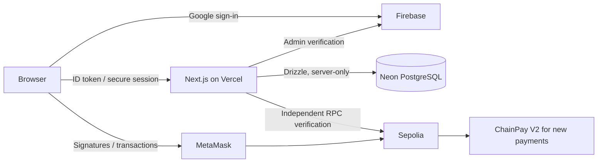

# Architecture

ChainPay is one Next.js 16 App Router application. Server Components handle protected pages and dashboard reads; small Client Components handle forms, Google login, MetaMask, polling, and QR rendering. The original `src/` structure is retained.

`src/app/api/[...path]/route.ts` is the HTTP dispatch boundary. It performs origin checking, server session authorization, validation, safe error mapping, and routes to feature services. The documented URLs remain conventional REST URLs. `src/features/*/server.ts` owns business rules. `src/lib/db`, `src/lib/auth`, and `src/lib/blockchain` hold adapters and shared policy.

Firebase UID maps to an internal `users.id` UUID. Domain foreign keys reference that UUID. A MetaMask connection is independent from application authentication. Only a verified signed challenge links a wallet to an account.

## Settlement lifecycle

1. Server validates a payment and creates an immutable intent. Request amounts/recipients come from PostgreSQL, never public payer input.
2. Browser estimates gas, checks balance, and presents a review bound to the account and network.
3. MetaMask signs a `pay(paymentId, merchant)` call. No personal metadata enters calldata.
4. Browser submits the hash with a random intent capability. Server compares the transaction against the stored expectation before recording `pending`.
5. Receipt page polls the server. Server verifies chain, sender, target contract, value, calldata, receipt, canonical block, two confirmations, and exactly one expected event.
6. One database transaction updates the receipt and associated request. Repeated submission/confirmation is idempotent; uniqueness constraints provide a second line of defense.

New intents pin the V2 address and version. The server contract registry resolves old V1 rows and pre-upgrade intents from their stored version and the server-only V1 address. V1 is never offered as a new-payment choice. Existing pending V1 broadcasts can still be saved and verified after the cutover. The transaction record retains the contract address and version so later configuration changes cannot silently reinterpret it.

Pending broadcast recovery is held in sessionStorage in the current tab. This is a temporary submission capability, not authoritative payment history. History and receipts come from PostgreSQL. The user can retry saving without paying again.

## Runtime decisions and limits

- Neon WebSocket `Pool` with Drizzle supports interactive transactions and row locks. Each operation closes its pool in `finally`, avoiding leaked serverless connections. Use a pooled Neon URL and region near Vercel.
- Firebase Admin, database and RPC initialization are lazy and server-only. A build needs no credentials.
- No Express, Render, Supabase, or standalone backend.
- Wallet soft removal preserves historical ownership and prevents reassignment to another account. Account-transfer policy is intentionally absent.
- Contacts and multiple verified wallets are implemented even though parts of the specification call them Phase 2; the execution prompt explicitly requests them.
- Request cancellation/expiration are application policies. The minimal forwarding contract cannot revoke an already signed transfer. Racing or late transfers are retained as independent payment records with an audit entry instead of settling the same request twice. See SECURITY.md.
- Receipt polling performs reconciliation while viewed. A scheduled indexer/replacement tracker is a future capability. Lost recovery data before submission needs operator investigation using the on-chain hash.
- Dashboard/activity currently read at most 500 recent records; totals say so explicitly.

Official integration references: [Firebase session cookies](https://firebase.google.com/docs/auth/admin/manage-cookies), [Drizzle with Neon](https://orm.drizzle.team/docs/connect-neon), [viem receipt retrieval](https://viem.sh/docs/actions/public/getTransactionReceipt). Next.js conventions were checked against the installed `node_modules/next/dist/docs/`.
